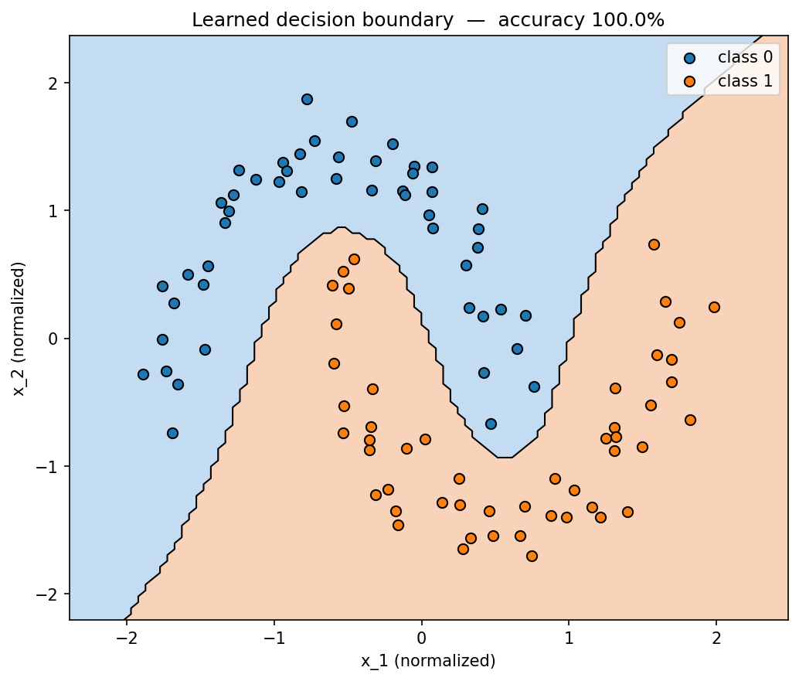

# micrograd

Scalar-valued autograd engine built from scratch, with an MLP trained on binary classification.

## What it does

Builds a dynamic computation graph by overloading Python operators on a `Value` class. Backpropagation walks the graph in reverse topological order and applies the chain rule at each node — the same algorithm PyTorch's `loss.backward()` runs, just on scalars instead of tensors.

## Approach

The `Value` class tracks each scalar's data, gradient, children, and a backward closure that encodes the local derivative rule. Three primitive operations — addition, multiplication, power — are sufficient: subtraction, division, and negation derive from these with no additional backward rules. The backward pass requires topological ordering because a node must receive gradients from all downstream consumers before propagating further back.

Softmax and negative log-likelihood loss are implemented as compositions of the primitive operations — the engine recovers the analytical gradient `dL/dlogit_i = p_i - 1` (correct class) and `p_i` (others) automatically, without special-casing. I verified gradient correctness against PyTorch to 1e-5 across all operators, including the softmax+NLL composition — which runs every primitive through the shared denominator and stress-tests gradient accumulation.

Built as an extension of Karpathy's [micrograd](https://github.com/karpathy/micrograd), with softmax + NLL loss, gradient verification against PyTorch, and an original make_moons classification demo.

## Results

`MLP(2, [16, 16, 1])` trained on `make_moons(n=100, noise=0.1)` for 100 epochs, full-batch SGD, learning rate 0.01, binary cross-entropy loss on a sigmoid-transformed output.

| metric | value |
|---|---|
| Final training loss | 31.8368 |
| Training accuracy | 100% (100/100) |
| Parameters | 337 |



The engine learns a curved decision boundary that correctly separates the two moons — a task that linear classifiers cannot solve. The loss plateaus around ~31 rather than approaching zero because the tanh-activated output saturates at ±1, capping sigmoid confidence at ~0.73 per sample; the network is fully discriminating, just not arbitrarily confident.

## Run it

```bash
pip install -r requirements.txt
pip install -e .                              # makes the micrograd package importable
pytest tests/                                 # verify gradient correctness against PyTorch
jupyter notebook notebooks/moons_demo.ipynb   # full training demonstration
```

## Notes

**Why `+=` not `=` in the backward closures.** A single `Value` node can feed multiple downstream consumers — for example, `y = x * x` reuses `x`, and the gradient of `y` w.r.t. `x` is `2x` from summing two `x`-paths. Using `=` instead of `+=` would silently drop the contribution from the second path through any reused node, producing wrong gradients with no error signal. Leaf gradients are initialized to `0.0` precisely so unconditional `+=` is safe.

**Why topological sort is necessary, not just convenient.** `backward()` can't walk the graph in arbitrary order. Each node's `_backward` distributes `out.grad` to its operands — for the distribution to be correct, `out.grad` must already contain *all* contributions from downstream consumers. Without topological ordering, a node could propagate a partial gradient before its full upstream contribution is accumulated, producing wrong gradients silently. This is the same dependency-resolution problem a compiler solves to schedule expression evaluation.

**The minimal primitive set.** `__add__`, `__mul__`, `__pow__`, plus the elementary functions `tanh`, `exp`, `log`, are enough to express softmax, NLL, BCE, and an arbitrary MLP. Derived operators (`__sub__`, `__truediv__`, `__neg__`, plus the `__r*__` reflections) compose from the primitives and inherit gradient correctness without any new backward rules. The public surface is rich; the gradient bookkeeping lives in only six places.

**Why `.double()` matters in the PyTorch reference tests.** PyTorch defaults to float32, which floors gradient comparison at ~1e-7. Casting reference tensors to float64 lets the tests assert agreement to 1e-5 without false negatives from precision mismatch with Python's native float arithmetic.
